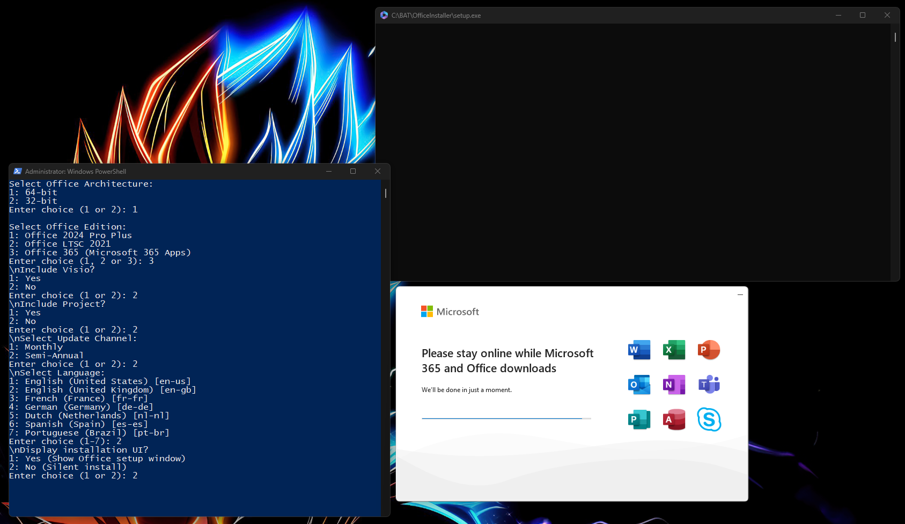

# Office Auto Installer

This PowerShell script automates the download, configuration, and installation of Microsoft Office 2024/2021/365, with optional components like Visio and Project.

## ✨ Features
- Choose 32-bit or 64-bit architecture
- Select language (en-us, de-de, fr-fr, etc.)
- Choose update channel (Monthly or Semi-Annual)
- Optional install of Visio and/or Project
- Prompt for Silent or Full UI installation
- Automatic admin elevation
- System PATH validation and fixes
- Full logging for installation steps and errors

## 🚀 Getting Started
1. Clone or download the repo
2. Right-click the `.ps1` script and **Run with PowerShell** (it will prompt for elevation if needed)
3. If it abruptly closes in the beginning I am most certain it is related to Policy Execution. This you can have set for this script specifically by running the batch file to execute it with a bypass.
4. Follow the interactive prompts, DO NOT close the windows pre-maturely otherwise it can corrupt the install and downloads.
5. Once the installer is complete, everything should be cleaned up and state where the logs are written.

## ⚠️ Disclaimer
This script downloads and installs Microsoft software. You are solely responsible for ensuring your use complies with Microsoft licensing. **Use at your own risk.** The author assumes no responsibility for any misuse or damage.

## 📄 License
This project is licensed under the [MIT License](./LICENSE).
