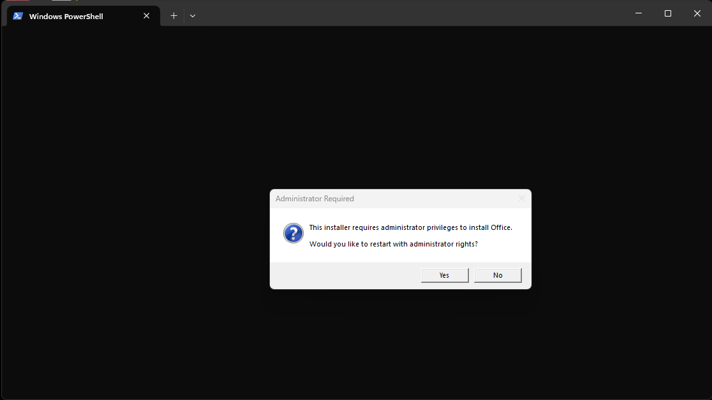
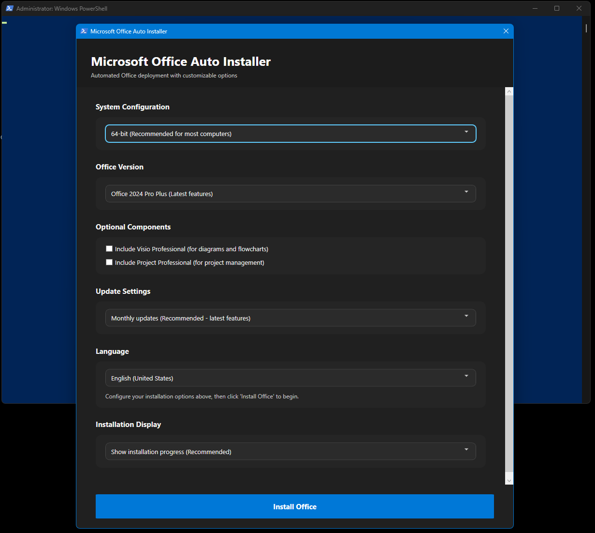

# Office Auto Installer




Install Microsoft Office 2024 / 2021 / Microsoft 365 through **official Microsoft channels**. This project follows the same **web launch pattern** as [Chris Titus Tech's WinUtil](https://github.com/ChrisTitusTech/winutil): run **PowerShell as Administrator**, then **`irm "…/office.ps1" | iex`**. A small bootstrap ([`office.ps1`](./office.ps1)) downloads the full **GUI** or **console** installer from GitHub. WinUtil uses a custom short URL (`christitus.com/win`); here the recommended URL is **GitHub Pages** (`…/office.ps1`), with **raw.githubusercontent.com** as a fallback. For offline or locked-down networks, use the **two-file** `.bat` + `.ps1` packages in the sections below.

> **Breaking rename:** `Launch-Office.ps1` was removed. The only bootstrap entry is **`office.ps1`**.

## Usage

Office Auto Install is meant to run **as Administrator**, like [WinUtil](https://github.com/ChrisTitusTech/winutil#usage).

1. **Start menu:** Right-click the Start button → **Terminal (Admin)** or **Windows PowerShell (Admin)** (Windows 10/11).
2. **Search:** Press Win, type *PowerShell* or *Terminal*, then **Ctrl+Shift+Enter**, or right-click → **Run as administrator**.

### Launch command

#### Stable (recommended) — GitHub Pages (shorter URL)

```powershell
irm "https://njvanas.github.io/Office-Auto-Install/office.ps1" | iex
```

#### Stable — raw GitHub (fallback if Pages is blocked)

```powershell
irm "https://raw.githubusercontent.com/njvanas/Office-Auto-Install/main/office.ps1" | iex
```

#### Dev branch payloads

This only changes which Git **branch** the **payload** scripts (`Install-Office-GUI-WPF.ps1` / `Install-Office.ps1`) are pulled from. You still invoke the same bootstrap URL; set the variable **before** `irm`. Your fork needs a matching branch (e.g. `dev`).

```powershell
$env:OFFICE_AUTO_INSTALL_BRANCH = "dev"
irm "https://njvanas.github.io/Office-Auto-Install/office.ps1" | iex
```

#### Console wizard (instead of GUI)

```powershell
$env:OFFICE_AUTO_INSTALL_USE_CONSOLE = "1"
irm "https://njvanas.github.io/Office-Auto-Install/office.ps1" | iex
```

#### Forks

```powershell
$env:OFFICE_AUTO_INSTALL_REPO = "yourname/Office-Auto-Install"
# Optional: $env:OFFICE_AUTO_INSTALL_BRANCH = "main"
irm "https://njvanas.github.io/Office-Auto-Install/office.ps1" | iex
```

#### Custom domain (WinUtil-style short link)

If you use a GitHub Pages [custom domain](https://docs.github.com/en/pages/configuring-a-custom-domain-for-your-github-pages-site), put the hostname in the root **`CNAME`** file (one line only — see GitHub’s docs; do not leave the placeholder comment lines in production). Then you can shorten the launch line to:

```powershell
irm "https://YOUR-DOMAIN/office.ps1" | iex
```

Otherwise point **`office.ps1`** at your domain with a redirect or reverse proxy to either:

- `https://njvanas.github.io/Office-Auto-Install/office.ps1`, or  
- `https://raw.githubusercontent.com/njvanas/Office-Auto-Install/main/office.ps1`

Only run **`irm … | iex`** from sources you trust.

---

### **GUI Version (download folder) ⭐**

**For the modern Windows 11 Fluent Design interface:**

1. Download **both files** to the same folder:
   - `Install-Office-GUI-WPF.ps1` (the main GUI application)
   - `Install-Office-GUI-SAFE.bat` (the launcher)

2. **Double-click** `Install-Office-GUI-SAFE.bat`

3. **Click "Yes"** when Windows asks for administrator permission

4. The beautiful GUI window will open with all options pre-configured

5. Click **"Install Office"** (or customize settings first)

**That's it!** The GUI will handle everything automatically.

### **Console Version (download folder)**

**For the step-by-step text-based interface:**

1. Download **both files** to the same folder:
   - `Install-Office.ps1` (the main installer script)
   - `Install-Office-SAFE.bat` (the launcher)

2. **Double-click** `Install-Office-SAFE.bat`

3. **Click "Yes"** when Windows asks for administrator permission

4. **Follow the simple prompts** - the script will guide you through everything!

**That's it!** The installer will:
- Check your system requirements
- Ask you simple questions about what you want
- Download and install Office automatically
- Keep the window open so you can see the results

### **⚠️ Important Notes**
- **Web launch (`office.ps1`):** stay online for bootstrap **and** Office setup; use **Windows PowerShell 5.1+** or **Windows Terminal** (same class of tool as WinUtil).
- **Download-folder mode:** **both** the `.bat` and `.ps1` must sit in the **same** folder.
- **Administrator rights** — required for a smooth run; the GUI can still prompt to elevate if needed.
- **Stay connected to the internet** — Office downloads during installation.
- **Don't close the window** during installation (about 10–30 minutes).

## 📦 **Available Files for Download**

### **Required Files (Choose One Method)**

**Remote run (no local files):**

- [`office.ps1`](./office.ps1) — bootstrap only; use the **Launch command** commands above (Pages or raw).

**For GUI Version (Recommended):**
- ✅ `Install-Office-GUI-WPF.ps1` - Main GUI application (Windows 11 Fluent Design)
- ✅ `Install-Office-GUI-SAFE.bat` - Launcher for the GUI version

**For Console Version:**
- ✅ `Install-Office.ps1` - Main console installer script
- ✅ `Install-Office-SAFE.bat` - Launcher for the console version

### **How to Download from GitHub**

1. **Individual Files:**
   - Click on the file name in the repository
   - Click the "Raw" button
   - Right-click and "Save As" to download

2. **All Files at Once:**
   - Click the green "Code" button
   - Select "Download ZIP"
   - Extract the ZIP file
   - Use the files from the extracted folder

3. **Using Git:**
   ```bash
   git clone https://github.com/njvanas/Office-Auto-Install.git
   ```
   (Replace `njvanas` with your GitHub user or org if you use a fork.)

### **Additional Files (Optional)**
- `README.md` - This documentation file (included in repository)
- `LICENSE` - MIT License (included in repository)
- `index.html` - GitHub Pages landing page (copy-paste commands and downloads)
- `Screenshot1.png` / `Screenshot2.png` - Application screenshots (included in repository when present)

### **GUI Version Features**
- ✅ **Remote-friendly** - `office.ps1` always pulls the latest `Install-Office-GUI-WPF.ps1` from GitHub before the window opens
- ✅ **Single File** - Main GUI is one `.ps1`; no extra dependencies beyond Windows / .NET Framework for WPF
- ✅ **Windows 11 Fluent Design** - Native Windows 11 look and feel with Fluent theme
- ✅ **Pre-filled Defaults** - All recommended options are already selected
- ✅ **Modern Design** - Beautiful, professional interface matching Windows 11 Settings app
- ✅ **Visual Interface** - No command-line prompts, everything in one window
- ✅ **Real-time Progress** - See download and installation progress with visual feedback
- ✅ **Easy Configuration** - Dropdown menus and checkboxes for all options
- ✅ **Status Updates** - Clear status messages throughout the process
- ✅ **Fully Self-Contained** - Downloads everything remotely, no manual setup needed
- ✅ **Accessibility** - WCAG 2.4.7 compliant focus indicators

### **Version Comparison**
| Feature | Web launch (`office.ps1`) | Console (folder) | GUI (folder) ⭐ |
|---------|---------------------------|------------------|----------------|
| How you start | `irm "…/office.ps1" \| iex` | `.bat` + `.ps1` | `.bat` + `.ps1` |
| Local files needed | None | 2 files | 2 files |
| Interface | Fetches console or WPF payload | Text menus | WPF window |
| Updates | Latest from GitHub branch you select (default `main`) | Your saved files | Your saved files |

Installer behavior (editions, languages, ODT) is the same for web vs folder launch; only the entry path changes.

## ✨ Features

### 🎯 **Beginner-Friendly Design**
- **Zero Technical Knowledge Required** - Simple, guided setup for everyone
- **Automatic Administrator Elevation** - Handles Windows permissions automatically
- **Smart Recommendations** - Suggests best options for typical users
- **Plain English Explanations** - No confusing technical jargon
- **Helpful Hints** - Guidance for every decision you need to make

### 🖥️ **Windows Integration**
- **WinUtil-style launch** - [`office.ps1`](./office.ps1) via GitHub Pages or raw GitHub; optional env vars for forks, dev branch, or console mode ([WinUtil](https://github.com/ChrisTitusTech/winutil))
- **Execution Policy Fix** - Automatically handles PowerShell execution policy restrictions
- **Easy Double-Click Launch** - Just double-click the .bat file when using the folder download
- **Right-Click Protection** - Prevents window from closing immediately
- **Automatic Admin Rights** - Requests elevation when needed with clear explanation
- **System Requirements Check** - Validates disk space, RAM, Windows version, and internet
- **UAC Handling** - Smooth integration with Windows security prompts
- **Professional Error Messages** - Clear explanations when something goes wrong

### 🎨 **Beautiful Interface**
- **Colorful Menus** - Easy-to-read, visually appealing interface
- **Progress Tracking** - Real-time feedback during download and installation
- **Step-by-Step Guidance** - Numbered steps with clear explanations
- **Smart Defaults** - Pre-selected recommended options
- **Comprehensive Summaries** - Review your choices before installation

### ⚙️ **Flexible Configuration**
- **Office Editions:** 2024 Pro Plus, LTSC 2021, Microsoft 365 Apps
- **Architectures:** 32-bit and 64-bit (with recommendations)
- **Languages:** 7 supported languages with clear descriptions
- **Update Channels:** Monthly or Semi-Annual with explanations
- **Optional Components:** Visio and Project with usage explanations
- **Installation Modes:** Visual or silent installation

## 🆘 **If You Have Problems**

### **Common Issues:**
- **Trying the web launch?** Use **Windows PowerShell** or **Terminal as Administrator**, paste a **Launch command** from the top of this README, and confirm the URL matches this repo (or your fork) when using `OFFICE_AUTO_INSTALL_*` variables.
- **`irm` / `iex` blocked or errors?** Run `Set-ExecutionPolicy -Scope CurrentUser RemoteSigned` once, or use the **folder download** `.bat` launcher instead.
- **"Files not found" error?** (folder mode) Put **both** the `.bat` and `.ps1` in the **same** folder.
- **Script won't run?** Right-click the `.bat` file → **Run as administrator**, or use the command-line methods below.
- **Antivirus blocking?** Temporarily allow the script or disable real-time scanning only for the install window (if your policy allows).
- **Internet connection issues?** Check connectivity; the bootstrap and Office both need Microsoft/GitHub access.

### **Alternative Methods (If Double-Click Doesn't Work):**

**Method 0 - Web launch (no local files):** same as **Launch command** at the top of this README — often the fastest fix if `.bat` paths or working directory cause trouble.

**Method 1 - Command Line (GUI Version):**
1. Right-click on PowerShell → "Run as Administrator"
2. Navigate to your files: `cd "C:\Users\YourName\Downloads"`
3. Run: `powershell -ExecutionPolicy Bypass -File "Install-Office-GUI-WPF.ps1"`

**Method 2 - Command Line (Console Version):**
1. Right-click on PowerShell → "Run as Administrator"
2. Navigate to your files: `cd "C:\Users\YourName\Downloads"`
3. Run: `powershell -ExecutionPolicy Bypass -File "Install-Office.ps1"`

**Method 3 - Copy & Paste:**
1. Right-click on PowerShell → "Run as Administrator"
2. Open the `.ps1` file (GUI or Console version) in Notepad
3. Select all content (Ctrl+A) and copy (Ctrl+C)
4. Paste into PowerShell window (Right-click → Paste)
5. Press Enter to run

## 🎯 **Perfect For**
- **Home Users** - Installing Office on personal computers
- **Small Businesses** - Setting up Office on multiple computers
- **IT Support** - Quick, reliable Office deployment
- **Students** - Easy Office installation for school work
- **Anyone** - Who wants Office installed without the hassle!

## 🔒 **Safety & Security**
- **100% Official Microsoft Tools** - Uses only Microsoft's official deployment tools
- **No Modifications** - Doesn't crack, patch, or modify Office in any way
- **Safe Downloads** - Downloads directly from Microsoft's servers
- **Transparent Process** - Full logging of all actions taken
- **Respects Licensing** - You must have proper Office licenses

## ⚠️ Disclaimer
This script downloads and installs Microsoft software through official Microsoft deployment tools. **You are responsible for having proper Microsoft Office licenses.** This tool does not crack, modify, or bypass any licensing - it only makes installation easier. **Use at your own risk.** The author assumes no responsibility for licensing compliance or any issues that may arise.

## 🛠️ **Technical Details**
- **WinUtil vs this repo** - [WinUtil](https://github.com/ChrisTitusTech/winutil) merges many sources with `Compile.ps1` into one large script; here the **GUI** and **console** payloads are already single files, and only the small [`office.ps1`](./office.ps1) bootstrap is needed for the `irm | iex` workflow.
- **Bootstrap** - [`office.ps1`](./office.ps1) downloads `Install-Office-GUI-WPF.ps1` or `Install-Office.ps1` from `raw.githubusercontent.com` over HTTPS, then runs it in-process with `Invoke-Expression`
- **Official Tools Only** - Uses Microsoft's Office Deployment Tool (ODT)
- **Execution Policy Safe** - Automatically handles PowerShell restrictions (folder and GUI flows)
- **Direct Downloads** - ODT and Office bits from Microsoft's servers; installer scripts from GitHub when using `office.ps1`
- **Standard Configuration** - Creates proper XML config files
- **Full Logging** - Detailed logs for troubleshooting
- **Windows Compatible** - Works on Windows 10/11 (Windows 7/8 may work)
- **System Requirements** - 4GB+ disk space, 2GB+ RAM recommended

## 📄 License
This project is licensed under the [MIT License](./LICENSE).
