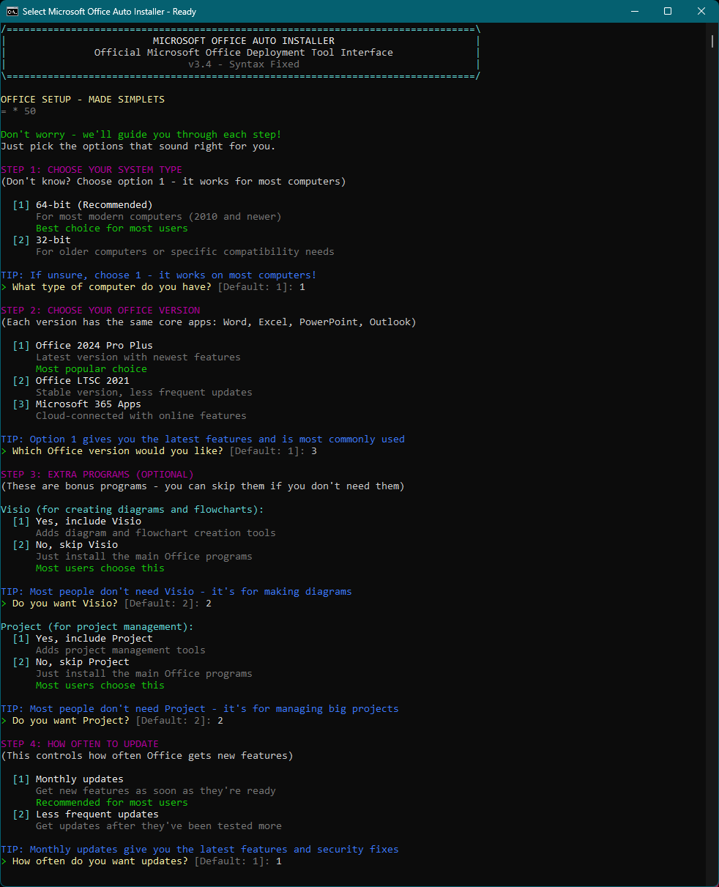
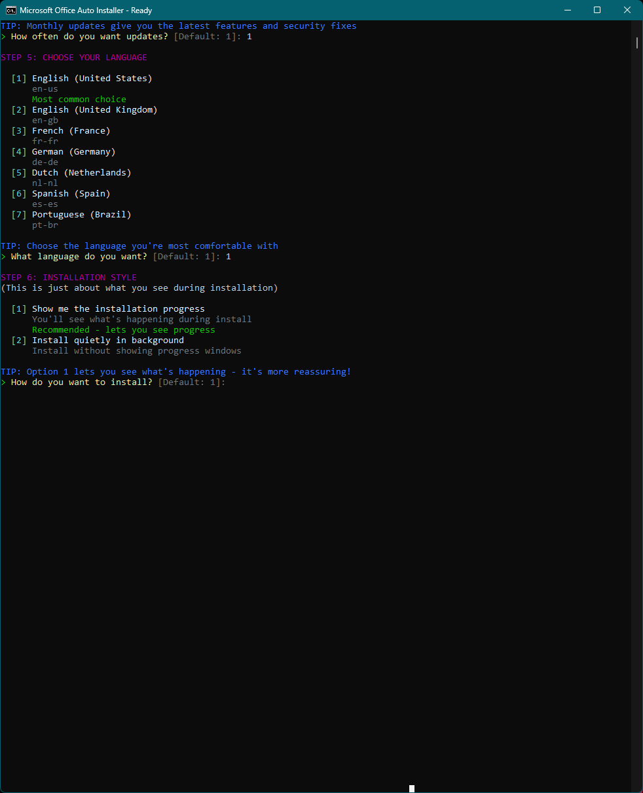

# Office Auto Installer




This enhanced PowerShell script provides a beautiful, beginner-friendly interface for downloading, configuring, and installing Microsoft Office 2024/2021/365 through official Microsoft channels. **Now with PowerShell execution policy fixes** - designed for any Windows user with no technical knowledge required!

## 🚀 **Quick Start (Choose Your Version)**

### **Option 1: GUI Version (RECOMMENDED) ⭐**

**For the modern Windows 11 Fluent Design interface:**

1. Download **both files** to the same folder:
   - `Install-Office-GUI-WPF.ps1` (the main GUI application)
   - `Install-Office-GUI-SAFE.bat` (the launcher)

2. **Double-click** `Install-Office-GUI-SAFE.bat`

3. **Click "Yes"** when Windows asks for administrator permission

4. The beautiful GUI window will open with all options pre-configured

5. Click **"Install Office"** (or customize settings first)

**That's it!** The GUI will handle everything automatically.

### **Option 2: Console Version**

**For the step-by-step text-based interface:**

1. Download **both files** to the same folder:
   - `Install-Office.ps1` (the main installer script)
   - `Install-Office-SAFE.bat` (the launcher)

2. **Double-click** `Install-Office-SAFE.bat`

3. **Click "Yes"** when Windows asks for administrator permission

4. **Follow the simple prompts** - the script will guide you through everything!

**That's it!** The installer will:
- Check your system requirements
- Ask you simple questions about what you want
- Download and install Office automatically
- Keep the window open so you can see the results

### **⚠️ Important Notes**
- **Both files must be in the same folder** for this to work
- **You need administrator rights** - Windows will ask for permission
- **Stay connected to the internet** - Office downloads during installation
- **Don't close the window** during installation (10-30 minutes)

## 📦 **Available Files for Download**

### **Required Files (Choose One Version)**

**For GUI Version (Recommended):**
- ✅ `Install-Office-GUI-WPF.ps1` - Main GUI application (Windows 11 Fluent Design)
- ✅ `Install-Office-GUI-SAFE.bat` - Launcher for the GUI version

**For Console Version:**
- ✅ `Install-Office.ps1` - Main console installer script
- ✅ `Install-Office-SAFE.bat` - Launcher for the console version

### **How to Download from GitHub**

1. **Individual Files:**
   - Click on the file name in the repository
   - Click the "Raw" button
   - Right-click and "Save As" to download

2. **All Files at Once:**
   - Click the green "Code" button
   - Select "Download ZIP"
   - Extract the ZIP file
   - Use the files from the extracted folder

3. **Using Git:**
   ```bash
   git clone https://github.com/yourusername/Office-Auto-Install.git
   ```

### **Additional Files (Optional)**
- `README.md` - This documentation file (included in repository)
- `LICENSE` - MIT License (included in repository)
- `Screenshot1.png` / `Screenshot2.png` - Application screenshots (included in repository)

### **GUI Version Features**
- ✅ **Single File** - Everything packaged in one file, no external dependencies
- ✅ **Windows 11 Fluent Design** - Native Windows 11 look and feel with Fluent theme
- ✅ **Pre-filled Defaults** - All recommended options are already selected
- ✅ **Modern Design** - Beautiful, professional interface matching Windows 11 Settings app
- ✅ **Visual Interface** - No command-line prompts, everything in one window
- ✅ **Real-time Progress** - See download and installation progress with visual feedback
- ✅ **Easy Configuration** - Dropdown menus and checkboxes for all options
- ✅ **Status Updates** - Clear status messages throughout the process
- ✅ **Fully Self-Contained** - Downloads everything remotely, no manual setup needed
- ✅ **Accessibility** - WCAG 2.4.7 compliant focus indicators

### **Version Comparison**
| Feature | Console Version | GUI Version ⭐ |
|---------|----------------|---------------|
| Interface | Text prompts | Modern WPF GUI |
| Design | Command-line | Windows 11 Fluent |
| Workflow | Step-by-step | One-click ready |
| Defaults | Interactive | Pre-filled |
| Learning | Great for learning | Fastest workflow |
| File Count | 2 files | 2 files |

Both versions work identically - choose the one you prefer!

## ✨ Features

### 🎯 **Beginner-Friendly Design**
- **Zero Technical Knowledge Required** - Simple, guided setup for everyone
- **Automatic Administrator Elevation** - Handles Windows permissions automatically
- **Smart Recommendations** - Suggests best options for typical users
- **Plain English Explanations** - No confusing technical jargon
- **Helpful Hints** - Guidance for every decision you need to make

### 🖥️ **Windows Integration**
- **Execution Policy Fix** - Automatically handles PowerShell execution policy restrictions
- **Easy Double-Click Launch** - Just double-click the .bat file to start
- **Right-Click Protection** - Prevents window from closing immediately
- **Automatic Admin Rights** - Requests elevation when needed with clear explanation
- **System Requirements Check** - Validates disk space, RAM, Windows version, and internet
- **UAC Handling** - Smooth integration with Windows security prompts
- **Professional Error Messages** - Clear explanations when something goes wrong

### 🎨 **Beautiful Interface**
- **Colorful Menus** - Easy-to-read, visually appealing interface
- **Progress Tracking** - Real-time feedback during download and installation
- **Step-by-Step Guidance** - Numbered steps with clear explanations
- **Smart Defaults** - Pre-selected recommended options
- **Comprehensive Summaries** - Review your choices before installation

### ⚙️ **Flexible Configuration**
- **Office Editions:** 2024 Pro Plus, LTSC 2021, Microsoft 365 Apps
- **Architectures:** 32-bit and 64-bit (with recommendations)
- **Languages:** 7 supported languages with clear descriptions
- **Update Channels:** Monthly or Semi-Annual with explanations
- **Optional Components:** Visio and Project with usage explanations
- **Installation Modes:** Visual or silent installation

## 🆘 **If You Have Problems**

### **Common Issues:**
- **"Files not found" error?** Make sure both files are in the same folder
- **Script won't run?** Try right-clicking the .bat file and "Run as administrator"
- **Antivirus blocking?** Temporarily disable it during installation
- **Internet connection issues?** Check your connection and try again

### **Alternative Methods (If Double-Click Doesn't Work):**

**Method 1 - Command Line (GUI Version):**
1. Right-click on PowerShell → "Run as Administrator"
2. Navigate to your files: `cd "C:\Users\YourName\Downloads"`
3. Run: `powershell -ExecutionPolicy Bypass -File "Install-Office-GUI-WPF.ps1"`

**Method 2 - Command Line (Console Version):**
1. Right-click on PowerShell → "Run as Administrator"
2. Navigate to your files: `cd "C:\Users\YourName\Downloads"`
3. Run: `powershell -ExecutionPolicy Bypass -File "Install-Office.ps1"`

**Method 3 - Copy & Paste:**
1. Right-click on PowerShell → "Run as Administrator"
2. Open the `.ps1` file (GUI or Console version) in Notepad
3. Select all content (Ctrl+A) and copy (Ctrl+C)
4. Paste into PowerShell window (Right-click → Paste)
5. Press Enter to run

## 🎯 **Perfect For**
- **Home Users** - Installing Office on personal computers
- **Small Businesses** - Setting up Office on multiple computers
- **IT Support** - Quick, reliable Office deployment
- **Students** - Easy Office installation for school work
- **Anyone** - Who wants Office installed without the hassle!

## 🔒 **Safety & Security**
- **100% Official Microsoft Tools** - Uses only Microsoft's official deployment tools
- **No Modifications** - Doesn't crack, patch, or modify Office in any way
- **Safe Downloads** - Downloads directly from Microsoft's servers
- **Transparent Process** - Full logging of all actions taken
- **Respects Licensing** - You must have proper Office licenses

## ⚠️ Disclaimer
This script downloads and installs Microsoft software through official Microsoft deployment tools. **You are responsible for having proper Microsoft Office licenses.** This tool does not crack, modify, or bypass any licensing - it only makes installation easier. **Use at your own risk.** The author assumes no responsibility for licensing compliance or any issues that may arise.

## 🛠️ **Technical Details**
- **Official Tools Only** - Uses Microsoft's Office Deployment Tool (ODT)
- **Execution Policy Safe** - Automatically handles PowerShell restrictions
- **Direct Downloads** - Gets files straight from Microsoft's servers
- **Standard Configuration** - Creates proper XML config files
- **Full Logging** - Detailed logs for troubleshooting
- **Windows Compatible** - Works on Windows 10/11 (Windows 7/8 may work)
- **System Requirements** - 4GB+ disk space, 2GB+ RAM recommended

## 📄 License
This project is licensed under the [MIT License](./LICENSE).
